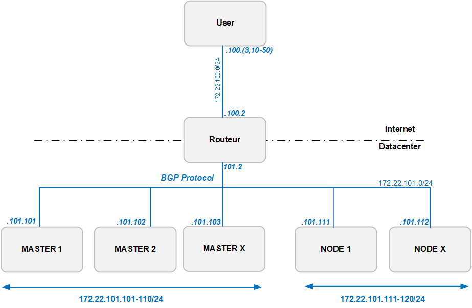

# Build Multi-tier load-balancing with Kubernetes cluster with Cillium cluster 


This project are build around Vagrant file to build kubernetes cluster with kubeadm in high availibility, 
with cilium configured overlay using BGP ECMP and LoadBalancer DSR (Direct Server Return) features.

Is to test k8s in Multi-tier load-balancing configuration.
- BGP ECMP with cilium/metallb (stateless)
- L4 LoadBlancer DSR with Cilium and ebpf (stateless)
- L7 LoadBlancer in pod (haproxy/envoy or nginx...) (StateFull)

https://vincent.bernat.ch/en/blog/2018-multi-tier-loadbalancer

# Prerequirist

- [vagrant](https://www.vagrantup.com/downloads)
- [virtualbox](https://www.virtualbox.org/wiki/Downloads)
- [git](https://git-scm.com/download/win)

# Start the cluster

```
# git clone https://github.com/mcarbonneaux/vagrant-kubeadm-cluster-mca.git
# cd vagrant-kubeadm-cluster-mca
# mkdir .ssh
# ssh-keygen -f ./.ssh/id_rsa
# vagrant up
```

# To connect to the cluster

```
# vagrant ssh server-<1-3>
```

# Use kubectl

kubectl are already configured and you are sudoed to root.

```
# kubectl get node
```

# Test plateform schema




# To create simple web pod (nginx) with loadbalancer dsr

The k8s cluster are already configured to support loadbalancer type.

You need juste to create pod with loadbalancer type.

- https://docs.cilium.io/en/v1.10/gettingstarted/bgp/#create-loadbalancer-and-backend-pods

Execute this command on any k8s cluster nodes (worker or controle plane)
```
kubectl create configmap nginx-default --from-file=/vagrant/test/nginx/default.conf
kubectl create configmap nginx-index --from-file=/vagrant/test/nginx/index.html
kubectl apply -f /vagrant/test/nginx/testlb.yaml
```

```
#  kubectl get svc
NAME         TYPE           CLUSTER-IP      EXTERNAL-IP   PORT(S)        AGE
kubernetes   ClusterIP      10.11.0.1       <none>        443/TCP        53m
test-lb      LoadBalancer   10.11.180.200   10.10.10.1    80:31490/TCP   46m
```

You can seen your service as `LoadBalancer` with an `EXTERNAL-IP` as `10.10.10.1`.

The base principe is to use `LoadBalancer` type service:
https://kubernetes.io/fr/docs/concepts/services-networking/service/#publishing-services-service-types

The kubeproxy cilium replacement support `ClusterIp` and `NodePort`, but also `LoadBalancer`.

```
apiVersion: v1
kind: Service
metadata:
  name: my-lb-service
spec:
  type: LoadBalancer
  ports:
    ... your service definition ...
  selector:
    ... your service selector....
```

# To test the loadbalancer dsr throug the bgp router

```
# vagrant ssh user
# sudo -s
# curl -s http://10.10.10.1 --interface 172.22.100.3
# curl -s http://10.10.10.1 --interface 172.22.100.50
# curl -s http://10.10.10.1 --interface 172.22.100.51
# curl -s http://10.10.10.1 --interface 172.22.100.52
# curl -s http://10.10.10.1 --interface 172.22.100.53
# curl -s http://10.10.10.1 --interface 172.22.100.54
# curl -s http://10.10.10.1 --interface 172.22.100.55
```

you while seen the node name in response:
```
nginx-69ddf6b8c9-6kjf9
```

# to join 10.10.10.0/24 network from host

user network are host-only network and are joinable from host.

you need juste to add route to router user network ip to join network behind router who route.

on windows in admin shell :
```
# route add 10.10.10.0/24  172.22.100.2
```

on linux root shell :
```
# route add -net 10.10.10.0/24 gw 172.22.100.2
```

# To connect on different vm with ssh

search in vagrant log line like :
```
Forwarding ports...                      
22 (guest) => 2200 (host) (adapter 1)    
```

for exemple for this vm you can access to the vm using `localhost` and port `2200`.

the user are `vagrant` and the password `vagrant`.

for router and user vm they are directly accesible from host by her ip, and you can connect to it directly on port 22 from host.
